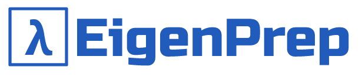

<div align="center">
  
</div>

# EigenPrep

EigenPrep is a standalone Python application designed to help users practice quantitative finance and brain teaser interview questions. It features a modular backend, a modern UI built with PyQt5, and local data storage using editable CSV files. No login or cloud features—everything runs locally for speed and privacy.

## Features
- Modern PyQt5 interface with custom theme and branding
- Local CSV files for questions, answers, and categories (easy to edit)
- Quiz mode: select category, timed 5-question quizzes, instant feedback, and override button to mark any question correct
- Timer counts up; see your score and time at the end
- Main menu with large buttons and logo
- Local session (no user accounts)
- Bundled assets (fonts, icons)
- Quality-of-life features: keyboard navigation, settings panel (planned)

## Dependencies
- Python 3.8+
- [PyQt5](https://pypi.org/project/PyQt5/)
- [pandas](https://pandas.pydata.org/)
- [pyyaml](https://pyyaml.org/)

Install dependencies with:
```sh
pip install -r requirements.txt
```

## Running the App
1. Clone the repository:
   ```sh
   git clone https://github.com/CUQuants/EigenPrep.git
   cd EigenPrep
   ```
2. Ensure your data files are in the `data/` directory (CSV format).
3. Run the main application:
   ```sh
   python -m src.main
   ```

## Usage
- The app launches with a main menu. Select Quiz to begin.
- In Quiz mode:
  - Choose a category and start a 5-question quiz.
  - Timer counts up; your time and score are shown at the end.
  - Submit answers and get instant feedback.
  - Use the **Override: Mark Correct** button to manually mark any question correct.
- All questions and answers are stored in CSV files for easy editing.

## Data & Assets
- All data is stored locally in the `data/` directory (CSV files).
- Fonts and icons are bundled in the `assets/` directory.

## Architecture
- `src/ui/main_window.py`: Main menu window (start quiz, OA, stats, settings, quit)
- `src/ui/quiz.py`: Quiz window (category selection, timed quiz, feedback, override)
- `data/`: CSV files for each question category
- `config/config.yaml`: App configuration (version, debug, etc.)

## Editing Questions
- Edit or add questions by modifying the CSV files in the `data/` directory.
- Each row should have: `category,question,answer,type`.

## Contributing
Pull requests are welcome! Please ensure new features are modular and maintain the app's speed and simplicity.

## License
MIT
